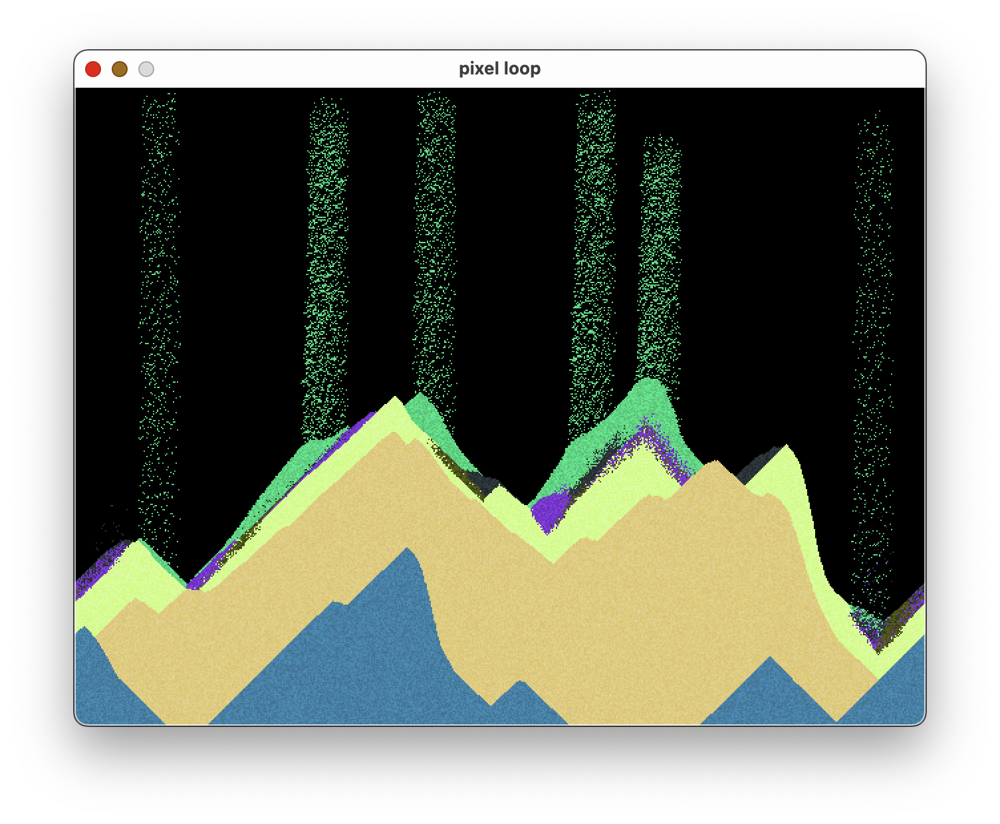

# 🏖️ Pixel Sand 🏜️

## Overview
Pixel Sand is a simple simulator of falling sand using my [Pixel Loop](https://crates.io/crates/pixel_loop) engine. It is an experiment, which might be extended in the future. If you are interested in it's development checkout my YouTube channel [MrJakob](https://youtube.com/c/mrjakob), where it is developed live.



## Features
- Simulates the movement of sand particles
- Utilizes the Pixel Loop engine for rendering

## Future Plans
- Enhance sand particle interactions
- Implement additional materials and behaviors
- Improve overall simulation performance

## Build Instructions
To build the Pixel Sand simulator use cargo:

```shell
cargo build --release
```

## Usage
Once built, run the `target/release/pixel_sand` binary to start the simulation. Experiment with different settings and observe the behavior of the falling sand particles.

## Controls

Press the Mouse button within the canvas and hold to place sand particles.

Press the W key for "Waterfall" mode. (Press again to disable)
Press the F key for "Fountains" mode. (Press again to disable)
